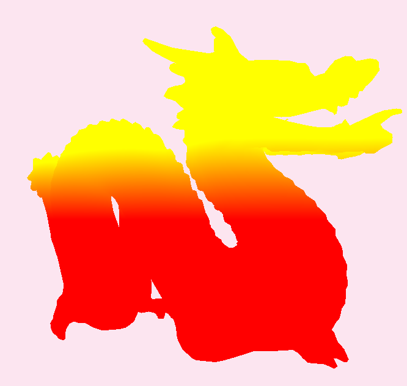

# Kranker3D - Simple rendering engine 

I am building this 3D rendering engine to learn openGL and make demoscene.
I started with absolutely no knowledge about GPU programming, so it's quite possible that there's a lot of flaws in this project. 
I'm open to any kind of criticism that could help me improve ! 

If anyone's interested in mentoring me on this project, here's my twitter account : [@KrankerApfel](https://twitter.com/krankerapfel	)

This project use OpenGL, GLAD, glm, GLFW, ImGUI and stb. You can use CMake to compile it.

## Helping ressources 

I'm learning from severals ressources, here the list below. 

* [opengl-tutorial french website](http://www.opengl-tutorial.org/fr/)
* "Algorithmes pour la synthèse d'images et l'animation 3D", Rémy Malgouyres (french book)
* "Ray Marching and Signed Distance Functions", Jamie Wong ([english website](http://jamie-wong.com/2016/07/15/ray-marching-signed-distance-functions/))
* [Inigo Quilez english blog](https://iquilezles.org/www/index.htm)
* [Inigo Quilez english youtube channel](https://www.youtube.com/channel/UCdmAhiG8HQDlz8uyekw4ENw)
* [LearnOpenGl.org english website to learn modern OpenGL](https://learnopengl.com/Getting-started/OpenGL)
* [The Cherno game engine youtube serie](https://youtu.be/JxIZbV_XjAs)
* OpenGL and Math lessons at my school

## Folders structure

* dll : store dlls :trollface: .
* resources : store ressource files (.obj, .bmp, .wav etc...).
* vendor : store dependencies
* src : store all Kranker3D logic.
	- core : engine core scripts 
	    - io : store I/O helpers...
		- objects : engine object script as camera, scene etc...
		- rendering : store class of objects involved in rendering (shader, mesh etc..)
			* pipeline : store rendering logic (SDFs, raymarching etc..)
			
	- ui : store ui logic

# Roadmap V 1.0

## Core 
- [ ] Config file
- [x] File reader
- [ ] Input class
- [ ] Resources manager

## Objects 
- [x] Camera
- [x] Transform class
- [x] Object class
- [ ] Obj loader
- [ ] Skybox
- [ ] Light

## Rendering  
- [x] Shader class
- [x] Mesh class 
- [ ] Material class 
- [ ] Texture
- [ ] Renderer class
- [ ] Scene classe
- [ ] Raytracing
- [ ] SDF
- [ ] Raymarching

## Materials
- [ ] Phong
- [ ] Lambert
